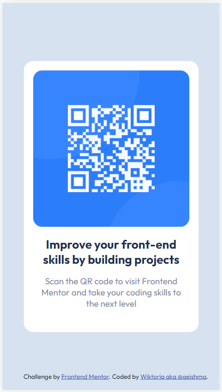

# Frontend Mentor - QR code component solution

This is a solution to the [QR code component challenge on Frontend Mentor](https://www.frontendmentor.io/challenges/qr-code-component-iux_sIO_H). 

## Table of contents

- [Overview](#overview)
  - [Screenshot](#screenshot)
  - [Links](#links)
- [My process](#my-process)
  - [Built with](#built-with)
  - [What I learned](#what-i-learned)
  - [Continued development](#continued-development)
- [Author](#author)

## Overview
It is my first project ever made, after 1 month of learning HTML and CSS from almost zero knowledge. Simple display page for QR code, using HTML and CSS. I did not use flexbox.

### Screenshot




### Links

- Solution URL: [Github](https://github.com/aeishma/qr-code-frontend-mentor)
- Live Site URL: [Add live site URL here](https://your-live-site-url.com)

## My process

### Built with

- Semantic HTML5 markup
- CSS custom properties

### What I learned

- I was wondering for a long time if it is a proper way of doing, to use `figure` instead of `img` in a simple `div`. Eventually, I did not find any reason to not do that and as I understood, semantically it might be a better choice. Let me know if you think the opposite.

```html
 <figure>
      
      <figcaption>
          <h1>Improve your front-end skills by building projects</h1>
          <p>Scan the QR code to visit Frontend Mentor and take your coding skills to the next level</p>
      </figcaption>
  </figure>
```
- The second big dilema was *how to make the card display in the center - horizontally and vertically*. I did not know how to use flexbox so I used a trick with `transform: translate`.
 ```css
 margin: 0 auto;
          position: absolute;              
          top: 50%;    
          left: 50%;
          margin-right: -50%;
          transform: translate(-50%, -50%);
  ```
 
### Continued development
During the next projects I want to focus more on positioning, especially using flexbox.

## Author

- Frontend Mentor - [@aeishma](https://www.frontendmentor.io/profile/aeishma)
- LinkedIn - [@wiktoria-stykowska](https://www.linkedin.com/in/wiktoria-stykowska/)
